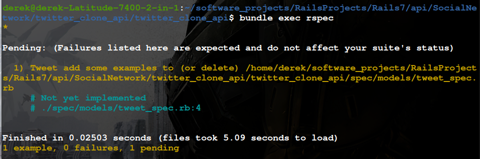
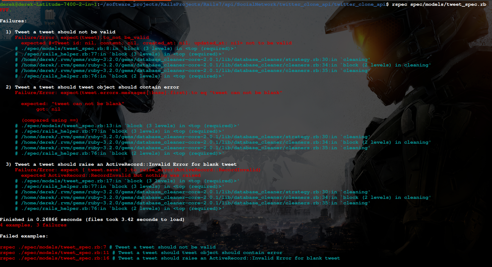
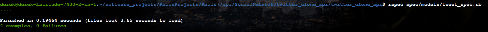
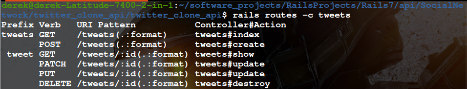
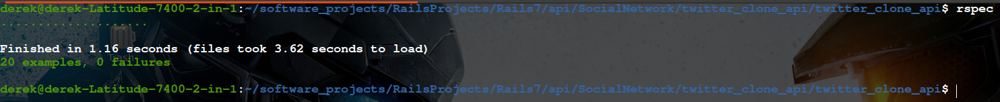

# Step By Step Guide to Building a RESTful API with Rails (7)
   
## **Introduction**

This is a guide to show you how to build a RESTful API with Rails 7. It is divided into chapters with the aim of allowing users follow this guide in discrete, incremental steps. The guide is centered around trying to build a backend for a twitter clone/social network. It will touch on topics like data modeling, api versioning, serialization, api documentation and other best practices. I will also try as much possible to follow the json:api specification. Without further wasting your time let’s dive in.

## **Chapter 1**
## Initial setup

This includes setting up the database and configuring your testing framework. In this tutorial we will use postgresql for our database and RSpec as our testing framework. We will also include the following gems related to testing

```
    - database_cleaner
    - shoulda_matchers
    - factory_bot
```

First things first, create a directory(give it any name) and run the following command:

```
mkdir rails_api_project

cd rails_api_project

rails new twitter_clone_api --api -T --database=postresql

cd twitter_clone_api

rails db:create
```
The above series of commands creates your new rails api project with a given directory structure. The last command creates both our development and test databases.

Now let’s go ahead and add these gems into the Gemfile and run bundle command again in the terminal.

```ruby
group :development, :test do
  gem "rspec-rails"
  gem "factory_bot_rails"
end

group :test do
  gem "database_cleaner-active_record"
  gem "shoulda-matchers"
end
```


We must configure a couple of the gems to get them to work properly.
For RSspec, run the following command

```
  rails g rspec:install
```


For database_cleaner gem, add the following code to the `rails_helper.rb` file inside the RSpec configure block

```ruby
  config.before(:suite) do
    DatabaseCleaner.strategy = :transaction
    DatabaseCleaner.clean_with(:truncation)
  end

  config.around(:each) do |example|
    DatabaseCleaner.cleaning do
      example.run
    end
  end
```

For factory_bot gem add the following to the rails_helper.rb inside the RSpec configure block

```ruby
config.include FactoryBot::Syntax::Methods
```


For shoulda-matchers gem add to the `rails_helper.rb` outside the RSpec configure block

```ruby
Shoulda::Matchers.configure do |config|
  config.integrate do |with|
    with.test_framework :rspec
    with.library :rails
  end
end
```


Run 
```
bundle exec rspec 
```

command in your terminal to see if everything works. If so, you should see the following output:



## Data Modeling
We are attempting to build a simple version of a complex system. In the real-world, this system would have very complex relationships between entities. It is very important to model your data properly as this will affect how your database structure will end up being, the relationships between the various tables as well as how efficient you construct your database queries. 

So first, we need to identify what these entities should be and then establish how they will relate to each other. 


## Brief Description of Specs
The application will allow users to create a profile which will be approved/verified via email. The authentication process will either be manual email input or via any of the Oauth providers, eg Google, Microsoft, etc.

A verified user can tweet content with a set character limit. A tweet comprise of content in the form of text, and can include emojis, images and gifs. A tweet can have retweets, likes, replies, quotes and bookmarks.

A user can have many followers and can also follow other users too(followings).
A thread is a series of linked tweets.

## Summary of Data modeling
    - user has_one :account, account belongs_to :user
    - user has_many :replies, replies belongs_to :user
    - user has_many likes, like belongs_to :user
    - user has_many :retweets(but scoped to one per tweet), retweet    belongs_to :user
    - user has_many :tweets, :tweet belongs_to :user
    - user  has_many :followers through :followings
    - user has_many :follows through :followings
    - user has_manhy :bookmarks, bookmark belongs_to :user
    - tweet has_many :replies(self-referential), reply belongs_to :tweet
    - tweet has_many :likes, like belongs_to :user
    - tweet has_many :retweets(self-referential, an original tweet will not have a link, a retweet will, allows you to follow a chain of retweets like a linked list), also scoped per user, I.e this tweet can have many retweets but one retweet per user
    - tweet has_many :bookmarks, :bookmark belongs_to :tweet
    - Each tweet will have an attribute called thread_link that links to another tweet in the thread. The shortest thread consists of just 2 tweets.

Even though the above may seem straight forward you have to remember that replies, retweets, quotes are all tweets-the same entity essentially. So we will have to architect the relationship between all of them knowing that they are essentially the same thing but with slight variation. Rails' active record allows us to model this easily and nicely and we will get to see how in the coming chapters.

Now that we have sufficiently modeled the database we can proceed with a clearer picture of how these entities relate to each other. When starting out a project I usually build out the core entities first, I.e, anything but the user model-that happens lasts and for me it is easier to just slap on authentication and authorization on top of everything else when the app is working. So let’s begin. 

We start with the Tweet model.

## The Tweet Model 
The tweet model is the central piece of the entire app. Everything else in the app, including the users(added later on) will revolve around this central piece. So it is important to get this bit right on the onset. 

A tweet will be the primary medium of communication between users and the large social network. So, for it to be useful it will have the following attributes
    • content-usually text
    • media-image, gif, video, etc
    • create and update timestamp(automatically created for us by active record)

That’s it! Simple! But enough to convey a user’s message. As we go along this tutorial you will see that this entity will accumulate more attributes but we won’t get ahead of ourselves. At the moment we just need to allow users to create a tweet to convey information.

We will begin by creating a model called tweet with the attributes listed above and some validations.
Copy the code below in the terminal to create the model

```
rails g model Tweet content media:attachment
```


Now let’s proceed to run the migration to add this table into the database.

```
rails db:migrate && rails db:migrate RAILS_ENV=test
```


Note here that we ran the command for the second time specifying the test environment. We want our test database to be consistent with our development database.

Now that we have our database setup, let’s write some tests. Before we do, we need to discuss what a tweet should entail. For a tweet to have any meaning, we must ensure that it has at least one of the 2 attributes not blank. A tweet could have either just text, media(photo, gif, video, etc) or both. We should not allow blank tweets, that is, tweets with neither attributes set to a value. The whole purpose of this social network we are trying to build is to allow users to communicate something meaningful to each other and blank tweets fail to serve this purpose so we won’t allow it. To ensure this we need to write some validation logic. 

Let’s write test cases first. First we want to ensure that a tweet is invalid if it has neither attributes present. Then we have to write a test case to test that a given tweet is valid even if just one of the attributes is present. So put the following code inside the `spec/models/tweet_spec.rb` file


```ruby
require 'rails_helper'

RSpec.describe Tweet, type: :model do
  let(:tweet) { build(:tweet) }

  context "a tweet should" do
    it "not be valid" do
      expect(tweet).to_not be_valid
    end

    it "tweet object should contain error" do
      tweet.save
      expect(tweet.errors.messages[:base].first).to eq "tweet can not be blank"
    end

    it "raise an ActiveRecord::Invalid Error for blank tweet" do
      expect { tweet.save! }.to raise_error(ActiveRecord::RecordInvalid)
    end

    it "should be valid with either attributes present" do
      tweet.content = "some content"
      expect(tweet).to be_valid
    end
  end
end
```

Ok. let’s run our test suite. It will fail and we will see why.




Our tests are failing because as it is now we have no validation for creating a tweet. Currently an empty tweet, which is a tweet with no value for neither attributes is permitted. Even though one of our test cases passes, it is a false positive because the definition of a valid tweet hasn’t been defined. As far as our tweet goes, any tweet object can be created in our system and it will be valid.

Let’s fix this with a custom validation. Create a file under the models directory called tweet_validator.rb and insert the following code.

 ```ruby
class TweetValidator < ActiveModel::Validator
  def validate(tweet)
    return unless tweet.content.nil? && tweet.media.blank?

    tweet.errors.add(:base, 'tweet can not be blank')
  end
end
 ```


This is pretty straight forward. An invalid tweet with both content and media attributes nil and blank respectively will raise an error.

In our Tweet model we have to include ActiveModel::Validations and then pass the name of our custom validator as an argument to the validates_with method.

```ruby
class Tweet < ApplicationRecord
  include ActiveModel::Validations

  has_one_attached :media

  validates_with TweetValidator
end
```

When you re-run the tests it should pass.



Ok.

Now we need to setup endpoints such that we can interact with the system from the outside via http request.

We need to develop the ability for users to do the following regarding tweets:
    • create a valid tweet
    • edit a tweet
    • show a tweet
    • show a list of tweets
    • delete a tweet 
These are typical CRUD(create, read, update and delete) actions

To proceed, we have to generate a controller and setup some routes. Also, The spec/requests directory will be created for us when we execute the rails generator. This is where we will test our endpoints.

Let’s generate our controllers


```
rails g controller Tweets index show create update destroy --skip-routes
```

We added the –skip-routes to prevent rails from polluting our `config/routes.rb` file with routes for each of the actions we created in the Tweets controller. We will use the handy resources method

```ruby
Rails.application.routes.draw do
  resources :tweets
end
```

This will generate the following RESTful routes




Now, we can write requests specs, testing the individual endpoints. So in your `spec/requests/tweet_spec.rb` put in the following test code


```ruby
require 'rails_helper'

RSpec.describe 'Tweets', type: :request do
  let!(:tweet1) { create(:tweet, content: 'I love Rails') }
  let!(:tweet2) { create(:tweet, content: 'Ruby is awesome') }

  describe 'GET #index' do
    before { get '/tweets' }

    it 'should return all valid tweets' do
      json_response = JSON.parse(response.body)
      expect(json_response.size).to eq(Tweet.all.size)
    end

    it 'should return a 200 status code' do
      expect(response).to have_http_status(200)
    end
  end

  describe 'GET #show' do
    before { get "/tweets/#{tweet1.id}" }

    context 'for an existing tweet' do
      it 'should return a tweet with the correct id' do
        json_response = JSON.parse(response.body)
        expect(json_response['id']).to eq(tweet1.id)
      end

      it 'should return a 200 status code' do
        expect(response).to have_http_status(200)
      end
    end

    context 'for a non-existing tweet' do
      let(:id) { 100 }

      before { get "/tweets/#{id}" }

      it 'should return status code of 404' do
        expect(response).to have_http_status(404)
      end

      it 'should return not found message' do
        json_response = JSON.parse(response.body)
        expect(json_response['message']).to eq('Tweet not found')
      end
    end
  end

  describe 'POST #create' do
    context 'for valid params' do
      valid_params = { content: 'I want to explore the internals of Ruby' }

      before { post '/tweets', params: valid_params.to_json, headers: { "Content-Type": 'Application/json' } }

      it 'should return 201 status for code' do
        expect(response).to have_http_status(201)
      end

      it 'should return created tweet' do
        json_response = JSON.parse(response.body)
        expect(json_response['content']).to eq(valid_params[:content])
      end
    end

    context 'for invalid params' do
      before { post '/tweets', params: {}.to_json, headers: { "Content-Type": 'Application/json' } }

      it 'should return status code of unprocessable_entity' do
        expect(response).to have_http_status(422)
      end

      it 'should return failure to create tweet message' do
        json_response = JSON.parse(response.body)
        expect(json_response['message']).to eq('Validation failed: tweet can not be blank')
      end
    end
  end

  describe 'PATCH #update' do
    context 'for valid params' do
      valid_params = { content: 'I love Ruby on Rails!!!' }

      before do
        patch "/tweets/#{tweet1.id}", params: valid_params.to_json, headers: { "Content-Type": 'Application/json' }
      end

      it 'return 204 status code' do
        expect(response).to have_http_status(204)
      end

      it 'record should be updated' do
        expect(tweet1.reload.content).to eq(valid_params[:content])
      end
    end

    context 'for invalid params' do
      before do
        patch "/tweets/#{tweet1.id}", params: { content: nil }.to_json, headers: { "Content-Type": 'Application/json' }
      end

      it 'return 204 status code' do
        expect(response).to have_http_status(422)
      end

      it 'record should not be updated' do
        expect(tweet1.reload.content).to_not be_nil
      end
    end
  end

  describe 'DELETE #destroy' do
    it 'should successfully delete tweet' do
      expect { delete "/tweets/#{tweet1.id}" }.to change(Tweet, :count).by(-1)
    end

    it 'should return 204 status code' do
      delete "/tweets/#{tweet1.id}"
      expect(response).to have_http_status(204)
    end
  end
end
```

To get the tests to pass we need to write out the methods corresponding to the CRUD methods. Put copy the code below in the `controllers/tweets_controller.rb` file

```ruby
class TweetsController < ApplicationController
  before_action :set_tweet, only: %i[show update destroy]

  def index
    @tweets = Tweet.all
    render json: @tweets, status: :ok
  end

  def show
    render json: @tweet, status: :ok
  end

  def create
    @tweet = Tweet.create!(tweet_params)
    render json: @tweet, status: :created
  rescue ActiveRecord::RecordInvalid => e
    render json: { message: e.message }, status: :unprocessable_entity
  end

  def update
    @tweet.update!(tweet_params)
    head :no_content
  rescue ActiveRecord::RecordInvalid => e
    render json: { message: e.message }, status: :unprocessable_entity
  end

  def destroy
    @tweet.destroy
    head :no_content
  end

  private

  def set_tweet
    @tweet = Tweet.find(params[:id])
  rescue ActiveRecord::RecordNotFound
    render json: { message: 'Tweet not found' }, status: :not_found
  end

  def tweet_params
    params.permit(:content, :media)
  end
end
```

There are duplications in both tests and code. Let’s fix that.

First, create a file called `json_response.rb` inside `controllers/concern` directory and add the following code

```ruby
module JsonResponse
  def json_response(object, status = :ok)
    render json: object, status:
  end
end
```

Include this module in the ApplicationController

```ruby
class ApplicationController < ActionController::API
  include JsonResponse
end
```

Now we refactor the TweetsController by implementing the method in this module. The refactored controller then looks like the following.


```ruby
class TweetsController < ApplicationController
  before_action :set_tweet, only: %i[show update destroy]

  def index
    @tweets = Tweet.all
    json_response(@tweets)
  end

  def show
    json_response(@tweet)
  end

  def create
    @tweet = Tweet.create!(tweet_params)
    json_response(@tweet, :created)
  rescue ActiveRecord::RecordInvalid => e
    json_response({ message: e.message }, :unprocessable_entity)
  end

  def update
    @tweet.update!(tweet_params)
    head :no_content
  rescue ActiveRecord::RecordInvalid => e
    json_response({ message: e.message }, :unprocessable_entity)
  end

  def destroy
    @tweet.destroy
    head :no_content
  end

  private

  def set_tweet
    @tweet = Tweet.find(params[:id])
  rescue ActiveRecord::RecordNotFound
    json_response({ message: 'Tweet not found' }, :not_found)
  end

  def tweet_params
    params.permit(:content, :media)
  end
end
```


We also refactor the request specs by first creating a module with a method that returns response parsed as JSON. Create a file inside the directory `spec/support/` called `request_helpers.rb`

```ruby
module RequestHelpers
  def json_response
    JSON.parse(response.body)
  end
end
```

Uncomment this line in `rails_helper.rb`

```ruby
Dir[Rails.root.join('spec', 'support', '**', '*.rb')].sort.each { |f| require f }

```


and include the module we just created inside RSpec configure block in the `rails_helper.rb`

```ruby
 # factory_bot configuration
  config.include FactoryBot::Syntax::Methods
```


Now refactor the tests. Put this code inside the `spec/models/tweets_spec.rb` file

```ruby
require 'rails_helper'

RSpec.describe 'Tweets', type: :request do
  let!(:tweet1) { create(:tweet, content: 'I love Rails') }
  let!(:tweet2) { create(:tweet, content: 'Ruby is awesome') }

  describe 'GET #index' do
    before { get '/tweets' }

    it 'should return all valid tweets' do
      expect(json_response.size).to eq(Tweet.all.size)
    end

    it 'should return a 200 status code' do
      expect(response).to have_http_status(200)
    end
  end

  describe 'GET #show' do
    before { get "/tweets/#{tweet1.id}" }

    context 'for an existing tweet' do
      it 'should return a tweet with the correct id' do
        expect(json_response['id']).to eq(tweet1.id)
      end

      it 'should return a 200 status code' do
        expect(response).to have_http_status(200)
      end
    end

    context 'for a non-existing tweet' do
      let(:id) { 100 }

      before { get "/tweets/#{id}" }

      it 'should return status code of 404' do
        expect(response).to have_http_status(404)
      end

      it 'should return not found message' do
        expect(json_response['message']).to eq('Tweet not found')
      end
    end
  end

  describe 'POST #create' do
    context 'for valid params' do
      valid_params = { content: 'I want to explore the internals of Ruby' }

      before { post '/tweets', params: valid_params.to_json, headers: { "Content-Type": 'Application/json' } }

      it 'should return 201 status for code' do
        expect(response).to have_http_status(201)
      end

      it 'should return created tweet' do
        expect(json_response['content']).to eq(valid_params[:content])
      end
    end

    context 'for invalid params' do
      before { post '/tweets', params: {}.to_json, headers: { "Content-Type": 'Application/json' } }

      it 'should return status code of unprocessable_entity' do
        expect(response).to have_http_status(422)
      end

      it 'should return failure to create tweet message' do
        expect(json_response['message']).to eq('Validation failed: tweet can not be blank')
      end
    end
  end

  describe 'PATCH #update' do
    context 'for valid params' do
      valid_params = { content: 'I love Ruby on Rails!!!' }

      before do
        patch "/tweets/#{tweet1.id}", params: valid_params.to_json, headers: { "Content-Type": 'Application/json' }
      end

      it 'return 204 status code' do
        expect(response).to have_http_status(204)
      end

      it 'record should be updated' do
        expect(tweet1.reload.content).to eq(valid_params[:content])
      end
    end

    context 'for invalid params' do
      before do
        patch "/tweets/#{tweet1.id}", params: { content: nil }.to_json, headers: { "Content-Type": 'Application/json' }
      end

      it 'return 204 status code' do
        expect(response).to have_http_status(422)
      end

      it 'record should not be updated' do
        expect(tweet1.reload.content).to_not be_nil
      end
    end
  end

  describe 'DELETE #destroy' do
    it 'should successfully delete tweet' do
      expect { delete "/tweets/#{tweet1.id}" }.to change(Tweet, :count).by(-1)
    end

    it 'should return 204 status code' do
      delete "/tweets/#{tweet1.id}"
      expect(response).to have_http_status(204)
    end
  end
end

```

Now run the tests. All green!



We are done with chapter 1!
Before we move on to the next chapter, I’m sure you noticed that we didn’t test the ability to add media. That is a bit more complicated and so deserves it’s own chapter.
